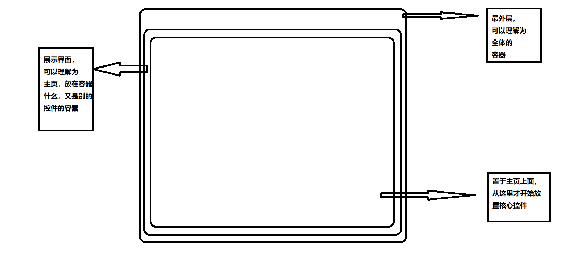

# Flutter基础UI界面的建立

* 值得注意的是 ： 本文使用的Dart和Flutter版本
```text
dart --version
Dart SDK version: 3.1.0-11.0.dev (dev) (Sat Apr 15 01:24:58 2023 -0700) on "windows_x64"
```

```text
flutter --version
Flutter 3.10.0-6.0.pre • channel master • https://github.com/flutter/flutter.git
Tools • Dart 3.1.0 (build 3.1.0-11.0.dev) • DevTools 2.23.1
```

## 核心规律


## 核心代码
```dart
import 'package:flutter/material.dart';   // 导入库

// 核心启动程序
void main() => runApp(MyApp());

// 图示中的‘总体容器‘
class MyApp extends StatelessWidget{
  @override
  Widget build(BuildContext context){
    return MaterialApp(
      // 其他代码
      // 这里面放置主页的实现类，我这叫做’Home‘
      home: Home(),
    );
  }
}

// 主页的实现类
class Home extends StatefulWidget {
  // 其他代码
  // 这里放置展示控件的类方法
  @override
  MainFace createState() => MainFace();
}

// 你要展示的控件类
class MainFace extends State<Home> {
  void  createState(){
    // 其他代码
  }

  @override
  Widget build(BuildContext context) {
    // 你需要在这里放置各种控件的代码
  }
}

```  


## 类的分类（文档旨在控件为主）
- 由于本人水平有限，对控件分类可能会出现不归属的问题  

1. [文本标签类](demo2.md)
2. [按钮类控件](demo3.md)
3. [输入类控件](demo4.md)
4. [资源类](demo5.md)
5. [导航类](demo6.md)
6. [容器类](demo7.md)
7. [对话框类](demo8.md)
8. [表格类](demo9.md)
9. [布局类](demo10.md)
10. [手势操作类](demo11.md)
11. [动画类](demo12.md)
12. [路由跳转类](demo13.md)
13. [主题类](demo14.md)
14. [事件构建器](demo15.md)

## Flutter中的状态
* 无状态控件：无状态小部件是指其外观和行为仅由构造函数中的参数决定，并且在构建后不会发生变化。无状态控件一般继承于StatelessWidget基类
* 带状态控件：有状态小部件是指其外观和行为不仅取决于构造函数中的参数，还取决于内部可变的状态。带状态控件一般继承于StatefulWidget基类

## <font color='red'>约定</font> ：从此文章开始，我们规定以下内容
* 用'...'代表类或者方法这里面有或者没有参数
* 对一些类中重复的参数，我很大可能会写第二次注解，但是可能会有额外的特性，所以你要特别注意
* 使用‘*’符号作为一些特殊备注，虽然这个符号容易和其他的（例如运算、sync*生成器声明等等等）混淆，但是你会很容易区分它，因为往往我会在带该符号的后面写上备注
* Widget{Icon}，这类符号说明这里传入的是一个Widget类，但是使用Widget的子类——Icon类的更多

> 本教程参考文档
> * 从零开始学Flutter开发》（基于Flutter1.17） 作者 ： 谭东，出版社 ： 电子工业出版社
> * Flutter实战》（基于Flutter3.0） 作者 ： 杜文， 出版社 ： 机械工业出版社
> * Flutter中国站开发者文档， https://flutter.cn/docs
